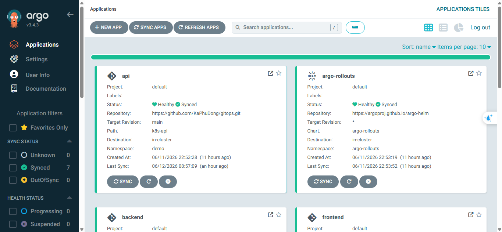
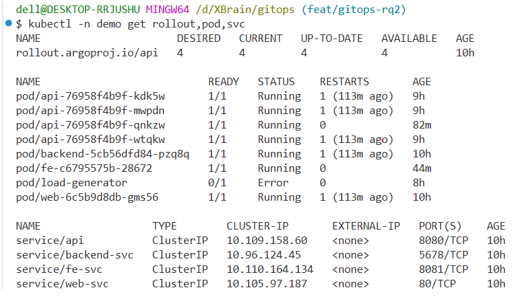
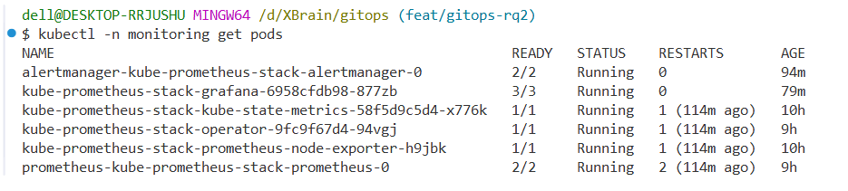
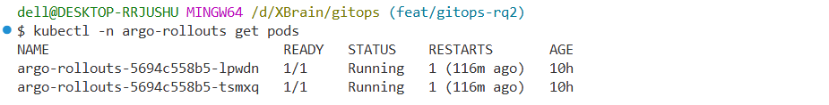
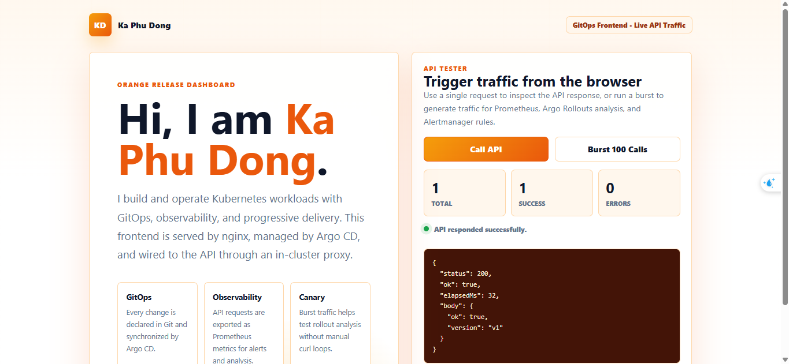
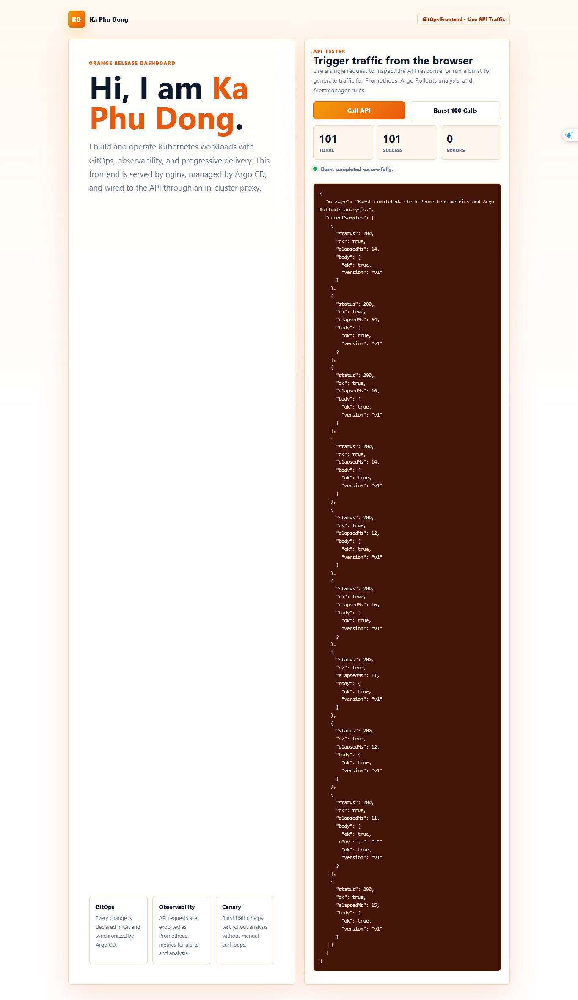
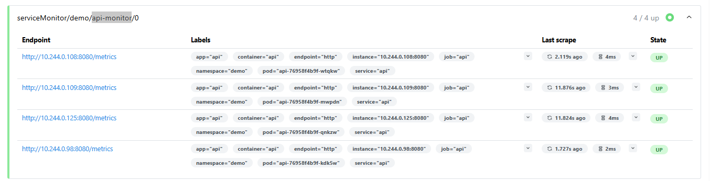
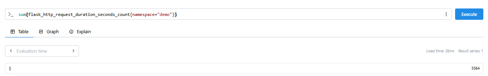
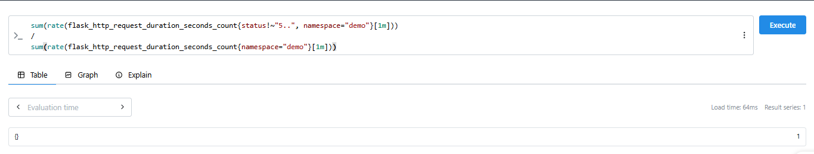

# Challenge: Ship Smartly

Repo này triển khai bài Challenge **Ship Smartly** theo 3 phần chính:

- **GitOps**: mọi thay đổi đi qua Git, Argo CD tự sync và self-heal.
- **Observability**: Prometheus/Grafana thu thập metric, có SLO và alert.
- **Progressive Delivery**: API dùng Argo Rollouts Canary, bản lỗi tự abort dựa trên metric Prometheus.

## Mục Tiêu Cần Đạt

- Argo CD quản lý toàn bộ manifest theo mô hình App-of-Apps.
- Frontend có UI tương tác trực tiếp với API.
- API có endpoint `/metrics` để Prometheus scrape.
- Có SLO success rate và alert gửi email.
- Canary dùng `AnalysisTemplate` để tự chấm điểm bằng Prometheus.
- Bản tốt được promote lên 100%, bản lỗi tự abort về bản ổn định.
- Rollback bằng `git revert`, không rollback tay trong cluster.
- CI validate manifest bằng `kubeconform`.

## Cấu Trúc Repo

```text
gitops/
|-- argocd/
|   |-- root.yaml
|   `-- apps/
|       |-- api.yaml
|       |-- argo-rollouts.yaml
|       |-- backend.yaml
|       |-- frontend.yaml
|       |-- kube-prometheus-stack.yaml
|       `-- web.yaml
|-- app/
|   |-- app.py
|   `-- Dockerfile
|-- docs/
|   |-- CONFIG_EXPLANATION.md
|   |-- PROJECT_FLOW.md
|   `-- TEST_CASES.md
|-- k8s/
|   |-- namespace.yaml
|   |-- backend.yaml
|   |-- frontend.yaml
|   `-- web.yaml
`-- k8s-api/
    |-- alerts.yaml
    |-- analysis.yaml
    |-- api.yaml
    `-- servicemonitor.yaml
```

## Tài Liệu Bổ Sung

- [docs/TEST_CASES.md](docs/TEST_CASES.md): hướng dẫn test từng case end-to-end.
- [docs/PROJECT_FLOW.md](docs/PROJECT_FLOW.md): giải thích flow dự án từ Git đến cluster, metric, alert và rollback.
- [docs/CONFIG_EXPLANATION.md](docs/CONFIG_EXPLANATION.md): giải thích cấu hình mentor có thể hỏi khi review bài.

## App-Of-Apps

Root Application:

```text
argocd/root.yaml
```

Root app trỏ tới:

```text
argocd/apps/
```

Các app con:

- `api`: deploy toàn bộ `k8s-api/`.
- `frontend`: deploy `k8s/frontend.yaml`.
- `backend`: deploy `k8s/backend.yaml`.
- `web`: deploy `k8s/web.yaml`.
- `kube-prometheus-stack`: cài Prometheus, Grafana, Alertmanager.
- `argo-rollouts`: cài Argo Rollouts controller.

Các app `frontend`, `backend`, `web` dùng `directory.include` để mỗi Application chỉ sync đúng file của nó trong thư mục `k8s/`.

Ví dụ:

```yaml
source:
  path: k8s
  directory:
    include: frontend.yaml
```

## Deploy Bằng GitOps

Apply root Application một lần:

```bash
kubectl apply -f argocd/root.yaml
```

Kiểm tra Argo CD:

```bash
kubectl -n argocd get applications
```

Kỳ vọng:

```text
root                    Synced   Healthy
api                     Synced   Healthy
frontend                Synced   Healthy
kube-prometheus-stack   Synced   Healthy
argo-rollouts           Synced   Healthy
backend                 Synced   Healthy
web                     Synced   Healthy
```

## Frontend UI

Frontend nằm ở:

```text
k8s/frontend.yaml
```

Frontend gồm:

- `ConfigMap/fe-page`: chứa HTML/CSS/JS.
- `ConfigMap/fe-nginx-config`: cấu hình nginx proxy.
- `Deployment/fe`: chạy `nginx:alpine`.
- `Service/fe-svc`: expose port `8081`.

Port-forward FE:

```bash
kubectl -n demo port-forward svc/fe-svc 8081:8081
```

Mở:

```text
http://localhost:8081
```

UI có 2 nút chính:

- `Call API`: gọi API một lần và hiển thị JSON response.
- `Burst 100 Calls`: gọi API nhiều lần để tạo traffic cho Prometheus, AnalysisTemplate và alert.

Frontend gọi API qua nginx proxy:

```text
Browser -> /api/ -> nginx -> http://api.demo.svc.cluster.local:8080/
```

Cách này giúp browser gọi same-origin, tránh CORS và không cần expose API trực tiếp.

## API

Source API:

```text
app/app.py
app/Dockerfile
```

API endpoints:

- `/`: trả JSON success hoặc lỗi giả lập.
- `/healthz`: readiness probe.
- `/metrics`: Prometheus scrape metric.

Biến môi trường quan trọng:

```yaml
env:
  - name: ERROR_RATE
    value: '0'
  - name: VERSION
    value: 'v1'
```

Ý nghĩa:

- `ERROR_RATE=0`: API chạy khỏe.
- `ERROR_RATE=0.5`: khoảng 50% request trả HTTP 500.
- `VERSION`: giúp chứng minh version đang chạy.

Build image local cho Minikube:

```bash
docker build -t w9-api:1 app/
minikube image load w9-api:1 -p w9
```

## Prometheus Và Alertmanager

Prometheus stack được cài bằng Helm qua:

```text
argocd/apps/kube-prometheus-stack.yaml
```

Cấu hình quan trọng:

```yaml
prometheus:
  prometheusSpec:
    serviceMonitorSelectorNilUsesHelmValues: false
    serviceMonitorNamespaceSelector: {}
    ruleSelectorNilUsesHelmValues: false
    ruleNamespaceSelector: {}
```

Ý nghĩa:

- Prometheus có thể scrape `ServiceMonitor` ngoài Helm chart.
- Prometheus có thể đọc `PrometheusRule` ngoài Helm chart.
- Namespace selector `{}` cho phép đọc resource ở namespace `demo`.

Port-forward Prometheus:

```bash
kubectl -n monitoring port-forward svc/kube-prometheus-stack-prometheus 9090:9090
```

Mở:

```text
http://localhost:9090
```

Port-forward Alertmanager:

```bash
kubectl -n monitoring port-forward svc/kube-prometheus-stack-alertmanager 9093:9093
```

Mở:

```text
http://localhost:9093
```

## ServiceMonitor

File:

```text
k8s-api/servicemonitor.yaml
```

Prometheus scrape API qua:

- Service label: `app=api`
- Port: `http`
- Path: `/metrics`
- Interval: `15s`

Query kiểm tra tổng request:

```promql
sum(flask_http_request_duration_seconds_count{namespace="demo"})
```

## SLO Và AnalysisTemplate

File:

```text
k8s-api/analysis.yaml
```

SLO:

```text
Success rate >= 95%
```

PromQL success rate:

```promql
sum(rate(flask_http_request_duration_seconds_count{status!~"5..", namespace="demo"}[1m]))
/
sum(rate(flask_http_request_duration_seconds_count{namespace="demo"}[1m]))
```

Cấu hình:

```yaml
interval: 10s
successCondition: result[0] >= 0.95
failureLimit: 2
```

Ý nghĩa:

- Cứ 10 giây Argo Rollouts query Prometheus một lần.
- Nếu success rate >= 95%, canary được xem là khỏe.
- Nếu success rate dưới ngưỡng quá số lần cho phép, rollout abort.

## Canary Tự Động

File:

```text
k8s-api/api.yaml
```

Chiến lược Canary:

```yaml
strategy:
  canary:
    analysis:
      templates:
        - templateName: success-rate-check
    steps:
      - setWeight: 25
      - pause:
          duration: 1m
      - setWeight: 50
      - pause:
          duration: 30s
      - setWeight: 100
```

Ý nghĩa:

- Đưa 25% traffic sang bản mới.
- Pause để Prometheus có dữ liệu.
- Nếu analysis pass, tăng lên 50%.
- Nếu vẫn pass, promote lên 100%.
- Nếu metric xấu, rollout abort về bản ổn định.

Theo dõi rollout:

```bash
kubectl argo rollouts get rollout api -n demo --watch
```

## Alert SLO

File:

```text
k8s-api/alerts.yaml
```

Alert fire khi error rate > 5% trong 30 giây:

```promql
sum(rate(flask_http_request_duration_seconds_count{status=~"5..", namespace="demo"}[1m]))
/
sum(rate(flask_http_request_duration_seconds_count{namespace="demo"}[1m]))
```

Kiểm tra alert:

```text
http://localhost:9090/alerts
```

Query:

```promql
ALERTS{alertname="ApiSuccessRateSLIViolation"}
```

Email receiver đang cấu hình:

```text
kaphudong04@gmail.com
```

Lưu ý:

- `smtp_auth_password` vẫn nên để dạng secret, không commit password thật lên repo public.
- Nếu password còn là `TODO_GMAIL_APP_PASSWORD`, alert có thể firing nhưng email chưa gửi được.

## Demo Good Canary

Sửa `k8s-api/api.yaml`:

```yaml
env:
  - name: ERROR_RATE
    value: '0'
  - name: VERSION
    value: 'v2-good'
```

Commit và push:

```bash
git add k8s-api/api.yaml
git commit -m "test: deploy healthy api canary"
git push
```

Tạo traffic bằng FE:

```text
http://localhost:8081 -> Burst 100 Calls
```

Kỳ vọng:

- Success rate >= 95%.
- Analysis pass.
- Rollout promote lên 100%.

## Demo Bad Canary Auto-Abort

Sửa `k8s-api/api.yaml`:

```yaml
env:
  - name: ERROR_RATE
    value: '0.5'
  - name: VERSION
    value: 'v2-bad'
```

Commit và push:

```bash
git add k8s-api/api.yaml
git commit -m "test: inject api errors for canary"
git push
```

Theo dõi rollout:

```bash
kubectl argo rollouts get rollout api -n demo --watch
```

Tạo traffic bằng FE:

```text
http://localhost:8081 -> Burst 100 Calls
```

Kỳ vọng:

- FE hiển thị một phần request lỗi.
- Prometheus error rate > 5%.
- Alert `ApiSuccessRateSLIViolation` pending rồi firing.
- Analysis fail.
- Rollout tự abort, bản lỗi không lên 100%.

## Rollback Bằng Git Revert

Rollback đúng GitOps:

```bash
git revert HEAD --no-edit
git push
```

Không dùng làm cách rollback chính:

```bash
kubectl rollout undo
```

Lý do:

- `kubectl rollout undo` chỉ sửa cluster.
- Git vẫn giữ desired state lỗi.
- Argo CD có thể sync bản lỗi quay lại.

## CI Validate

GitHub Actions chạy:

```bash
kubeconform -strict -ignore-missing-schemas -summary argocd/ k8s/ k8s-api/
```

Mục tiêu:

- Bắt lỗi YAML.
- Validate manifest Kubernetes cơ bản.
- Bỏ qua schema CRD không có sẵn như Argo CD Application, Rollout, ServiceMonitor, PrometheusRule.

Local fallback nếu không có `kubeconform`:

```bash
kubectl apply --dry-run=client --validate=false -f argocd/root.yaml
kubectl apply --dry-run=client --validate=false -f k8s/
kubectl apply --dry-run=client --validate=false -f k8s-api/
```

## Lệnh Kiểm Tra Nhanh

```bash
kubectl -n argocd get applications
kubectl -n monitoring get pods
kubectl -n argo-rollouts get pods
kubectl -n demo get rollout,pod,svc
kubectl argo rollouts get rollout api -n demo
```

Kiểm tra FE gọi API:

```bash
kubectl -n demo exec deploy/fe -- wget -qO- http://127.0.0.1/api/
```

Kỳ vọng:

```json
{"ok":true,"version":"v1"}
```

## Checklist Nộp Bài

- Repo có `Rollout`, `AnalysisTemplate`, `ServiceMonitor`, `PrometheusRule`.
- Toàn bộ thay đổi deploy qua Git và Argo CD.
- Argo CD apps Synced/Healthy.
- FE UI gọi API trực tiếp được.
- FE Burst tạo traffic thật.
- Prometheus scrape được API.
- Prometheus metric tăng sau khi Burst.
- Có SLO và giải thích rõ query/ngưỡng.
- Alert fire khi inject lỗi.
- Alertmanager gửi email.
- Canary bản tốt promote.
- Canary bản lỗi auto-abort.
- Rollback bằng `git revert`.
- CI validate pass.

## Evidence Cần Bổ Sung

Tạo thư mục:

```text
docs/images/
```

Sau khi test từng case, chụp ảnh minh chứng và đặt đúng tên file bên dưới. README đã ghi sẵn tên và mô tả để dễ đối chiếu khi nộp bài.

| File ảnh | Mô tả cần chụp |
| --- | --- |
| `docs/images/01-argocd-apps-synced.png` | Argo CD UI hoặc terminal `kubectl -n argocd get applications`, thể hiện `root`, `api`, `frontend`, `kube-prometheus-stack`, `argo-rollouts`, `backend`, `web` đều `Synced/Healthy`. |
| `docs/images/02-demo-pods-running.png` | Terminal `kubectl -n demo get rollout,pod,svc`, thể hiện `rollout/api`, pod `api-*`, `fe-*`, `backend-*`, `web-*` Running và service `fe-svc` port `8081`. |
| `docs/images/03-monitoring-pods-running.png` | Terminal `kubectl -n monitoring get pods`, thể hiện Prometheus, Grafana, Alertmanager, Operator đều Running. |
| `docs/images/04-rollouts-controller-running.png` | Terminal `kubectl -n argo-rollouts get pods`, thể hiện Argo Rollouts controller Running. |
| `docs/images/05-frontend-call-api.png` | Frontend tại `http://localhost:8081` sau khi bấm `Call API`, hiển thị JSON response từ API. |
| `docs/images/06-frontend-burst-traffic.png` | Frontend sau khi bấm `Burst 100 Calls`, hiển thị total/success/error count và kết quả burst. |
| `docs/images/07-prometheus-target-api-up.png` | Prometheus Targets tại `http://localhost:9090/targets`, target API ở trạng thái `UP`. |
| `docs/images/08-prometheus-api-request-total.png` | Prometheus query `sum(flask_http_request_duration_seconds_count{namespace="demo"})`, thể hiện request count tăng sau khi bấm Burst. |
| `docs/images/09-prometheus-success-rate.png` | Prometheus query success rate, thể hiện bản khỏe có kết quả gần hoặc bằng `1`. |
| `docs/images/10-good-canary-promoted.png` | Terminal `kubectl argo rollouts get rollout api -n demo --watch`, thể hiện good canary promote lên 100% và Rollout Healthy. |
| `docs/images/11-bad-canary-running.png` | Rollout đang chạy canary sau khi đổi `ERROR_RATE=0.5` và `VERSION=v2-bad`. |
| `docs/images/12-bad-canary-auto-aborted.png` | Rollout auto-abort khi analysis fail, thể hiện bản lỗi không được promote lên 100%. |
| `docs/images/13-prometheus-error-rate.png` | Prometheus query error rate, thể hiện tỷ lệ 5xx vượt `0.05` khi inject lỗi. |
| `docs/images/14-prometheus-alert-firing.png` | Prometheus Alerts tại `http://localhost:9090/alerts`, alert `ApiSuccessRateSLIViolation` ở trạng thái `Firing`. |
| `docs/images/15-alertmanager-alert.png` | Alertmanager UI tại `http://localhost:9093`, hiển thị alert API đang firing hoặc grouped. |
| `docs/images/16-email-alert-received.png` | Email nhận được tại `kaphudong04@gmail.com` từ Alertmanager. Có thể che thông tin nhạy cảm. |
| `docs/images/17-git-revert-rollback.png` | Terminal `git log --oneline` hoặc GitHub commit history, thể hiện đã dùng `git revert` để rollback. |
| `docs/images/18-rollback-healthy.png` | Argo CD hoặc rollout sau rollback, thể hiện API trở lại Healthy. |
| `docs/images/19-ci-validate-passed.png` | GitHub Actions job `validate` pass sau khi chạy `kubeconform`. |

## Evidence Đã Có

### 01. Argo CD Apps Synced



### 02. Demo Pods Running



### 03. Monitoring Pods Running



### 04. Argo Rollouts Controller Running



### 05. Frontend Call API



### 06. Frontend Burst Traffic



### 07. Prometheus Target API Up



### 08. Prometheus API Request Total



### 09. Prometheus Success Rate



Gợi ý thứ tự đưa ảnh vào báo cáo:

1. Argo CD và pod health.
2. FE gọi API và Burst traffic.
3. Prometheus target/metric.
4. Good canary promote.
5. Bad canary abort.
6. Alert firing và email.
7. Git revert rollback.
8. CI validate pass.
